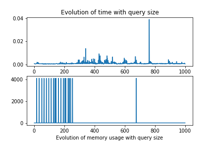

# Web data model project

## Streaming Algorithms for XPath
## Author : François Amat
## contact : francois.amat@enst.fr

# Implementation of xpath algorithm : simple case.
## Usage :
  python linear_parsing.py filename_of_xml query
## the linear parsing is done in few steps :
 Algorithm (sketch):
1. Initialization: represent path query as an array for each step, maintain an array index i of the current step in the path, maintain a stack S of index positions
2. startDocument: empty stack S; i=1
3. startElement: if path[i] and element match, proceed to next step;
  otherwise, make a failure transition. Push i on S.
4. endElement: Pop old i from S.
5. text: If path[i]=text, we found a match. Otherwise, do nothing.

This algorithm explanation is quite clear. The only missing part is the implementation of the failure transition
## Implementation of the failure transition
  The failure transition tell us to which state we want to go when a failure is done (when path[i] != current_element).
```
  def get_failure_transition(path):
      path = np.array(path)
      fail_array = [0]
      for i in range(1,len(path)+1):
          j = 0
          while(j < i and i >= 1 and np.array_equal(path[:j] , path[i-j:i])):
              j+=1
          if(j > 0):
              j -= 1
          fail_array.append(j)
      return fail_array
```
  This code will give an array where array[i] will give the next state when there is a failure at the state i.

  If we do not implement the failure transition and we consider that the state 0 is the only state when there is a failure, the query "//a/a" will be wrong for example.

  The linear parse algorithm is in the src/linear_parsing.py file:
```
def linear_parse(file,path):
    # Start document
    S = []
    state_i = [0]
    i = 0
    count = 0
    Results = []
    fail_array = get_failure_transition(path)
    with open(file,'r') as f:
        for line in f :
            begin, current_el = line.split(' ')[0:2]
            current_el = current_el.replace('\n','')
            i = state_i[-1]
            if(i == len(path)):
                if(S[-1] not in Results):
                    Results.append(S[-1])
                i = fail_array[i]
            if(begin == '0'): # true, start Element
                S.append(count)
                count +=  1
                if(path[i] == current_el):
                    i += 1
                else:                    #do failure transition
                    i = fail_array[i]
                    if(path[i] == current_el):
                        i+=1
                state_i.append(i)

            else:
                if(S):
                    S.pop()
                    state_i.pop()

    return Results
```
it follows the algorithm given.

The algorithm can be tested in the test.py file where there is a test case to check
if the algorithm is correct.


# Implementation of xpath algorithm : complex case.
## Usage :
  python lazy_dfa.py filename_of_xml query

## Implementation of the lazy dfa.

The lazy dfa is like a normal dfa with the possibily of stay put when there is an error.

So we need to separate the query into multiples p_i and then transform our failure transition : when we end a p_i xpath, the failure transition give the latest state when there is a failure.

This is done here :
```
for i in range(len(cuts) - 1 ):
    indice_i  = cuts[i]
    indice_j = cuts[i+1]
    fail_tmp = get_failure_transition(path[indice_i:indice_j])
    fail_tmp  = [x + indice_i for x in fail_tmp]
    fail_array += fail_tmp
```
In this way we can process the desired queries.

# Time and memory test on both algorithms.
##  Protocol
  The tests programms are called `get_perf_lazy.py`and `get_perf_linear.py`
  - The program creates a xml file with a certain number of node and a certain height.
  - The program creates a simple xpath query.
  - The program loops on the query length create a graph of time and memory used.
  - The program loops on the number of node create a graph of time and memory used.
  - The program loops on the height number and create a graph of time and memory used.
  - Finaly the program loops on both number of node and height.

## Results
The memory usage captured does not work, I tried numerus techniques on jupyter notebook and python script but the results where never consistent. I suppose this due to the fact of how python use its data.
### Results linear parsing





These results were not good, They show that there is not correlations between the height of the document and the query size, changed alone.


But when we modify both the number of node and height we observe that the algorithm should be linear in the term of number of node, and the multipling factor whould be correlated to the height of the document.

### Results lazy dfa


As for the linear parsing, the results were not really conclusive for the the number of node and query size variation alone.


But when we modify both the number of node and height we observe that the algorithm behave in a similar fashion as the linear one.

# Conclusions
Although the results of my experiments were not conclusive, that the memory measurement did not work properly. I think that the two algorithm can be used to work with large data, as seen in the tests when there were a variation of the number of nodes and height of the xml document.
In addition, the fact that theses algorithms can be used in a streaming way is quite useful, and that's probably why my memory measurment were not working.
