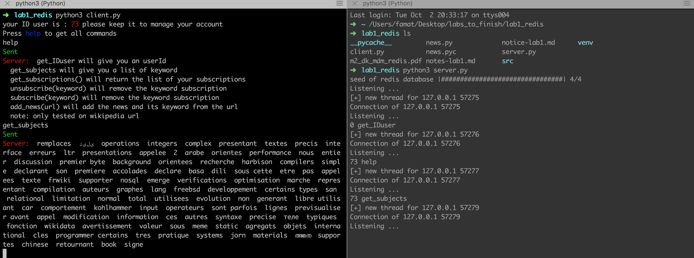
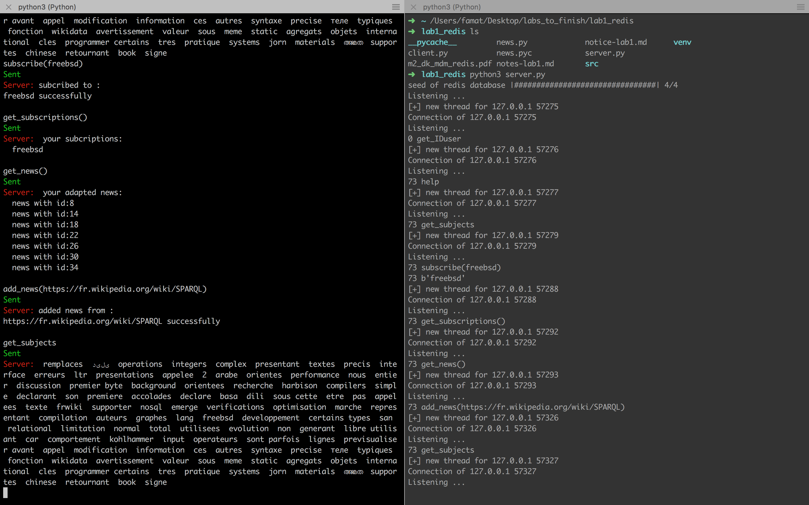

# Redis project : newslater
## author: Amat François
## contact: amat.francois@gmail.com
## Intro
This mini-project has be done to get familiar with redis functions. It implements a very simple newslater system.

## Set-up
First install on your machine redis, python3 and the following python libraries :
```
pip3 install redis,gensim,urllib,progress,termcolor
```
Launch Redis server by the following command :
```
redis-server
```
The redis-server should be launch at the port 6379
Open two terminals and launch
```
python3 server.py
python3 client.py
```
The server will start to seed the redis database by parsing some wikipedia pages.

## Redis structure
  news.py is the file where all the redis functions are used.

  I have defined the news as an hset with an id and their body.

  I have defined a global set of keywords for an easier implementation of the get_subjects function.
  
  In addition, there is a set mapping all keywords to their news_id.

  Finnaly, the user is just an id in a simple store with an set "user_keyword:<id_user>" to store all keyword for each user.

## Client/Server structure
  The client here do all the functions (subcribe and publish).

  There is an socket with a communication of a couple of (id, command) from the client to the server.

  The server will handle all the commands given in the section below.

  In addition, useful activity logs will be print in the console used to launch the server.

## Fonctionnalities:
- help :
  Prompt help will show all the possible commands.

- get_IDuser:
  Prompt help and the server will send you your id.

- get_subjects :
  Prompt get_subjects and the server will send you all the current subject in the database.

- get_subscriptions:
  Prompt get_subscriptions and the server will send you all the subcriptions associated with your id.

- subcribe(keyword):
  Prompt subscribe(keyword) and the server will subcribe the user to this keyword

- unsubcribe(keyword):
  Prompt subscribe(keyword) and the server will unsubcribe the user to this keyword

- add_news(url):
  Prompt add_news(url) with an **wikipedia url** and the server will parse the body of this html page, get the keywords associated and store (html body, keywords) in the database.

## Screenshots





## leads for further fonctionnalities
- Right now the system is made without the server knowing which are the clients, therefore the server cannot publish as a notification to the new clients.
 However, There is an empty publish function in news.py that can be adapted to send an email for example.

- The second lead would be to implement an web interface in order to subcribe directly from an url.

## Conclusion:
I found the redis database very simple in its usage and very convenient for simple project like that.
